# prepareImagesMACSima

This groovy script extracts, renames and merges the images corresponding to the MACSima capture cycles. Specifically, for each ROI it renames the images of the different channels with the name of the corresponding marker and joins them into a single merged TIFF image.

## Download prepareImagesMACSima code
1. Go to the GitHub repository `prepareImagesMACSima`
2. Click on `<>Code`>`Download ZIP`

    
    

3. The downloaded repo will be found at the Downloads directory of your computer

## Running the code through ImageJ/Fiji
1. Create a shortcut to the `imgserver` on your computer
 - Open two `File Explorer` tabs on your computer. In one you should be on `This Computer`, while in the other you should be on the `imgserver`.

    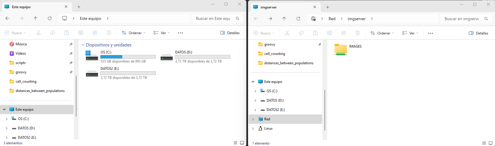
    

 - Click on the `IMAGES` folder inside the imgserver tab and drag it to your other window inside `This computer`. When you release it, a pop up will appear, make sure to unclick the option `Reconnect on login`.

    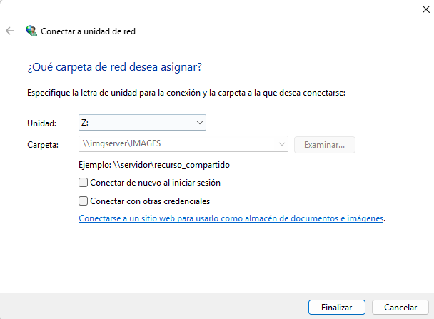
    

 - After this, you should have a shortcut to `imgserver/IMAGES` in the `This computer` location on your computer

    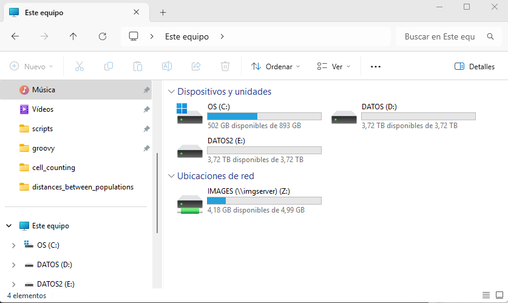
    

2. Open the ImageJ/Fiji application
3. In the search engine type 'script’ and click on the `Script... /File/New/Script` option

    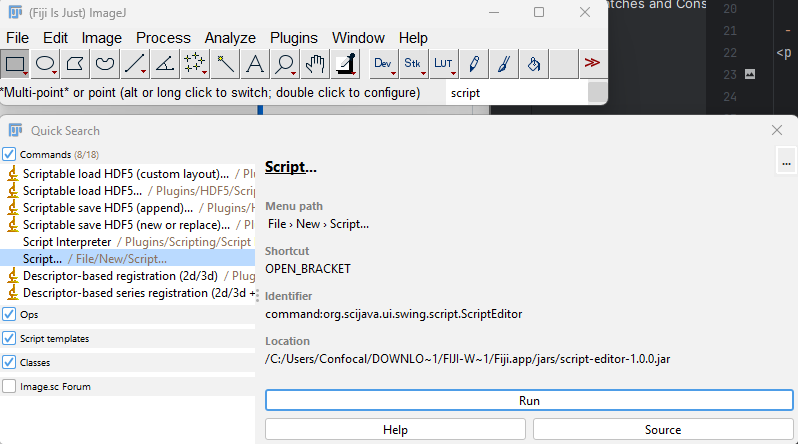
    

4. Click on `Run` and a new tab will open

    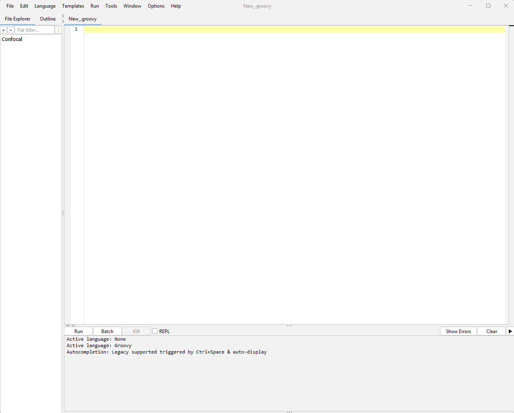
    

5. In this new window, click on `File>Open...` and navigate to the Downloads folder where you have saved the repo. Once in the repo location, click on the `prepareImagesMACSima.groovy` and open it.
 - IMPORTANT: Repos usually have a typical folder hierarchy. Therefore, to get to the `prepareImagesMACSima.groovy` script, you will probably have to navigate to `prepareImagesMACSima > groovy > src > main > prepareImagesMACSima.groovy`

    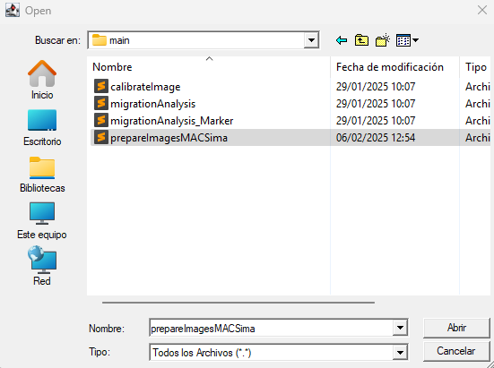
    

6. Press the `Run` button to compile the script

    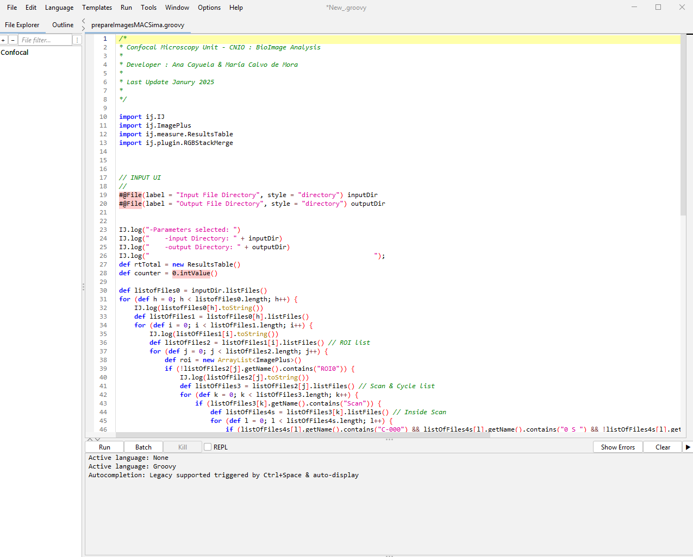
    

7. Then a dialog will be displayed in order to set both the input directory path in which your images are ( This is where you make used of the shortcut created in step 1, navigate to `\\imgserver\IMAGES\CONFOCAL\MACSima` until your specific experiment. IMPORTANT: In the input directory path you must specify up to the folder `PreprocessedData`, otherwise the script will not work) and the output directory in which you want to save your final images (TIP: a folder named `1_OUTPUTS MACSIMA` has been created in the imgserver (`"\\imgserver\IMAGES\CONFOCAL\MACSima\1_OUTPUTS MACSIMA"`) where we recommend to save your final images under a folder named the same as your project. This will help the CMU to track the projects)

    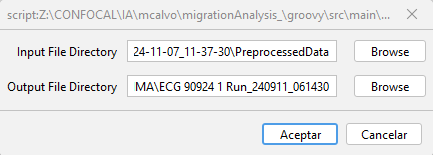
    

8. Click on `Accept`. This will make the script to continue processing. A log window will appear to update about the processing status

    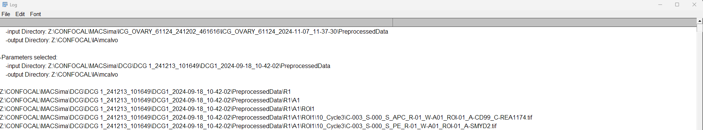
    

9. Once the processing finishes (one way to identify that it has finished is that in the Fiji window, you will see that you are able to hit Run again on the script, while the ‘Kill’ button is blocked) you will be able to check the output images located in the output directory previously selected.

    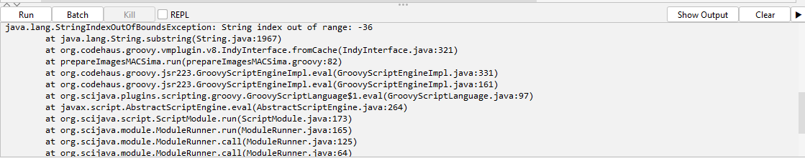
    

    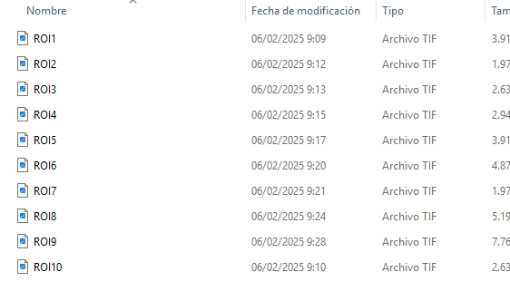
    

10. Now, you can open your windows with Qupath and see the different channels with the corresponded markers.
- Open QuPath and drag the ROI you want to visualize

    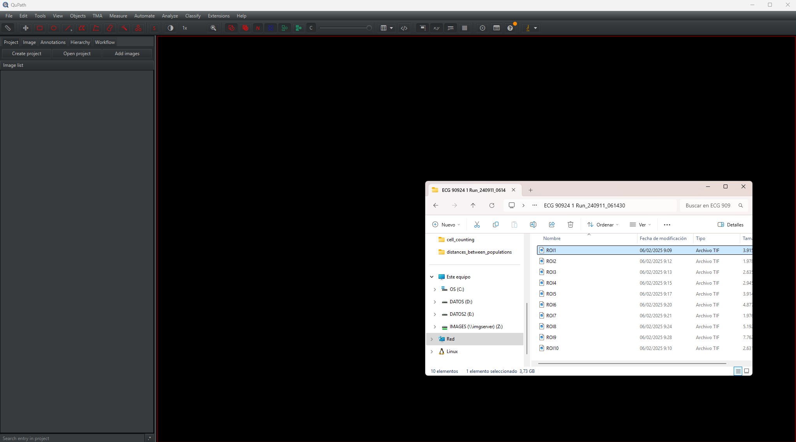
    

- Once the image is loaded, click on the `Brightness & contrast` option and start analyzing your results!

    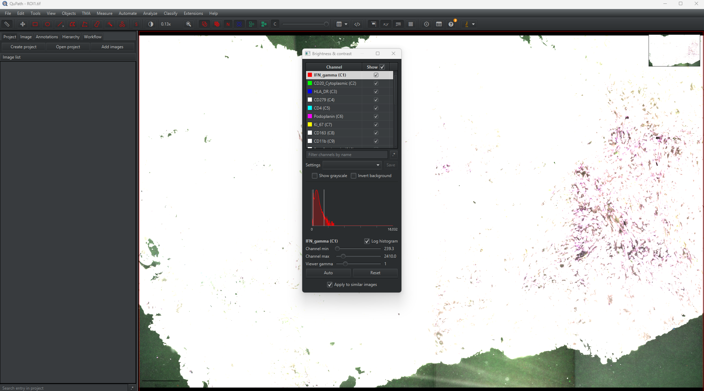
    

**CAUTION**: If you wish to do your analysis on VisioPharm (it does not affect visualization in QuPath or Fiji ), we aware that you follow the next steps in order to mantain the names of your channels and image resolution.
Open the .tif images saved after running the `prepareImagesMACSima` script and convert to ome.tif files with QuPath.
1. Open the QuPath application
2. Create a project for your .tif images resulted after running the `prepareImagesMACSima.groovy` script. To achive this click on `Create project` and select an empty folder where you want to save the qupath project.

    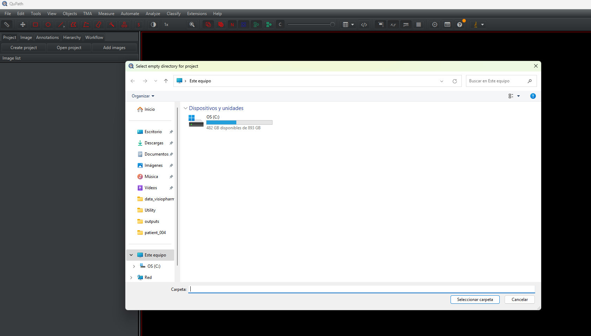
    

3. With your just created QuPath project, drag your .tif images saved after running the `prepareImagesMACSima.groovy` script to it.

    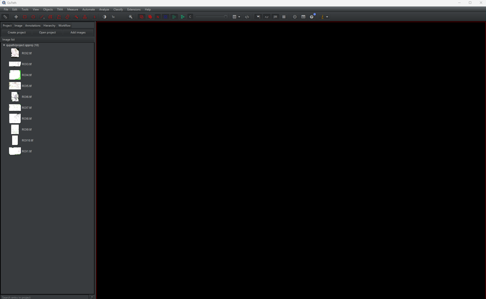
    

4. Click on `Automate > </> Script editor` and a pop-up window will appear

    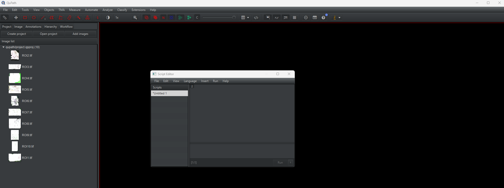
    

5. Open the file `fromTiffToOmeTiff.groovy` (you should propably have to navigate to `prepareImagesMACSima > groovy > src > main > fromTiffToOmeTiff.groovy`) with a text editor app (ex: sublime, bloc de notas) and copy the code
6. Paste it on the `</> Script editor` window

    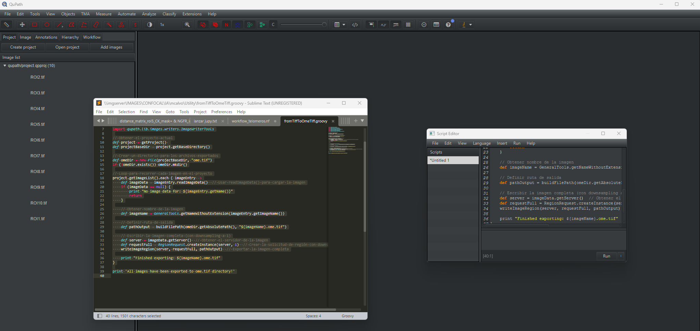
    

7. Click on Run
8. After the execution finishes your .ome.tif files will be located inside a `ome.tif folder` in your qupath project folder.

    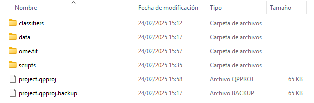
    

9. Start to analyze! :)
